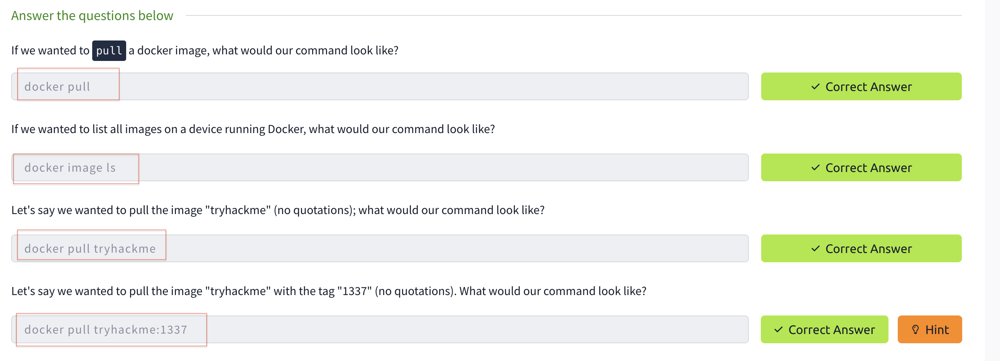
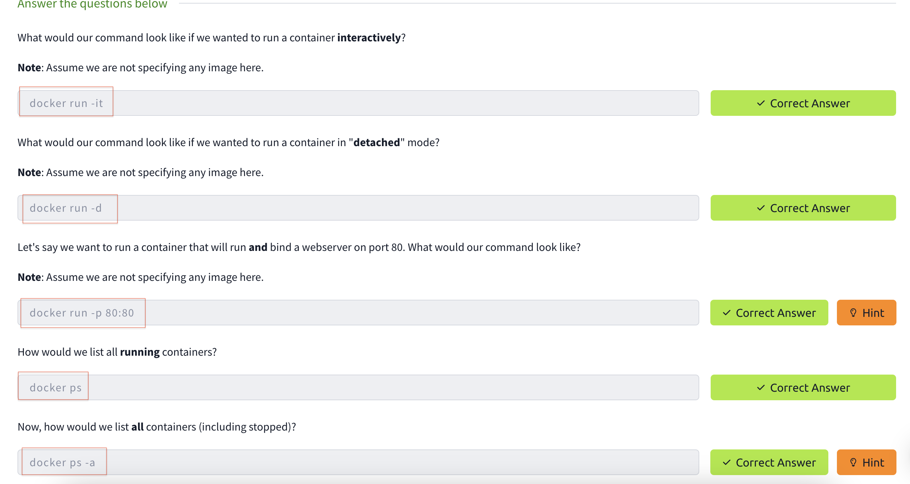
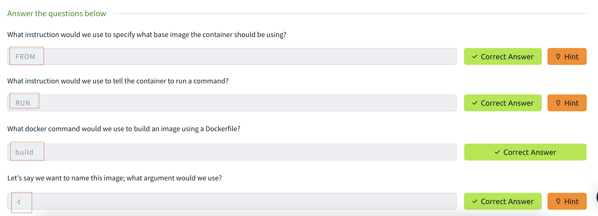
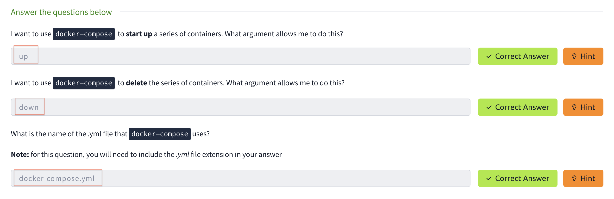
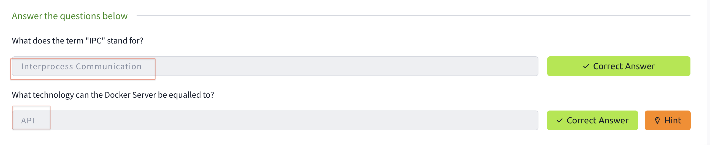
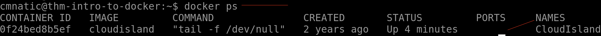
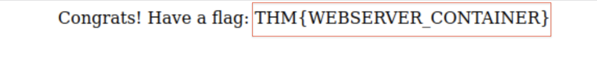
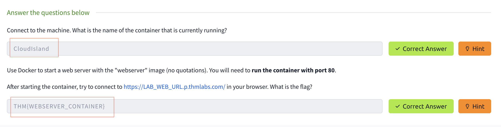
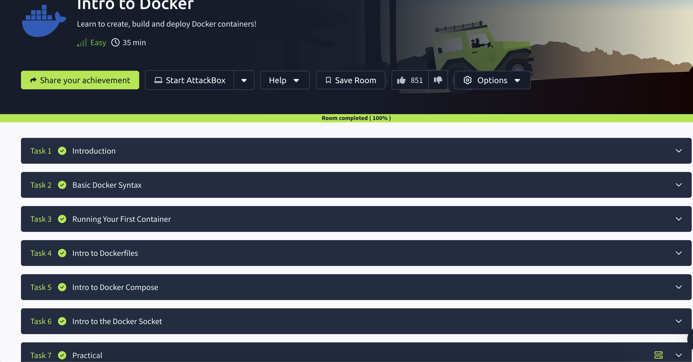

# Intro-to-Docker

I completed the Docker course on TryHackMe, where I explored the following topics:

✅ The basic syntax for getting started with Docker (e.g., docker pull, docker image, docker image ls, docker image rm)

✅ Running and deploying your first container (e.g., docker run, docker ps, docker ps -a)

✅ Creating your own image using a Dockerfile (e.g., FROM, WORKDIR, RUN, EXPOSE, CMD)

✅ How Docker Compose orchestrates multiple containers (e.g., docker-compose up, docker-compose start, docker-compose stop, docker-compose build)

## Task2 Correct Answer

## Task3 Correct Answer

## Task4 Correct Answer

## Task5 Correct Answer

## Task6 Correct Answer

## Finding the answer to task 7–1

## Finding the answer to task 7–2

## Task7 Correct Answer

## All Task Completed

